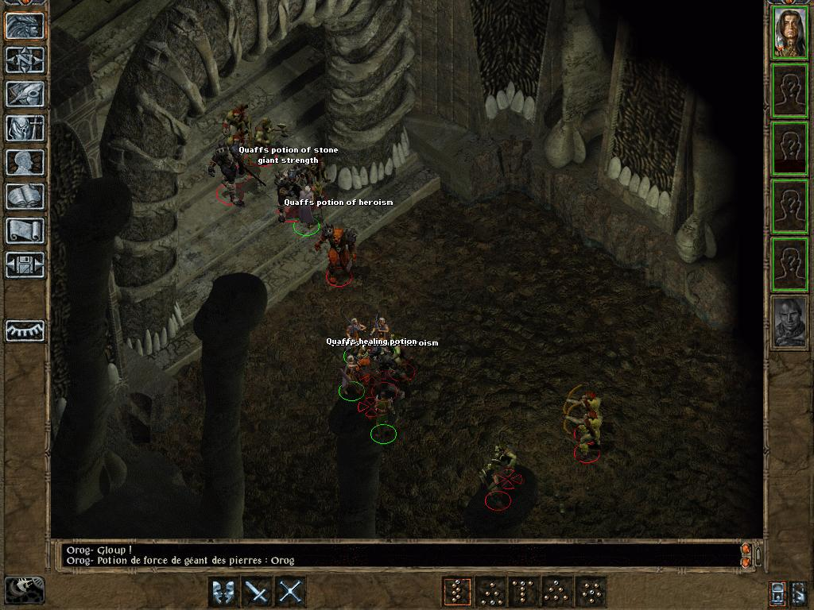

# BuTcHeRy

<strong>Author:</strong> <a href="https://www.baldursgateworld.fr/lacouronne/members/draztik.html">DrAzTiK</a> 
<strong>Version:</strong> 4.0.0 
<strong>Languages:</strong> <a href="readme-FR.md">French</a>, English 
<strong>Platform:</strong> Windows

<strong>Mod Forum:</strong> <a href="https://www.baldursgateworld.fr/lacouronne/butchery/">BuTcHeRy</a>
  

## Overview

The main objectif of this little mod is to add a challenging and fun fight in Firkraag's lair.

I like Baldur's Gate a lot, and I wrote this mod (first version in 2010) to become a minimum familiar with some modding stuffs. Thanks to Freddy_Gwendo, the BuTcHeRy is now compatible with the Enhanced Editions. I also added a few improvements.

Secondary objectives are:

- Allow players to fight in a big room or large space because it is really boring and frustrating to fight in a corridor, especially in in BG2.
- Difficulty level scaling: difficulty will be ajusted according to the game difficulty level which can be set in the Gameplay subsection of the Options menu. (more info <a href="#components">below</a>).
- Have a 'butchery fight', with some spawn and respawn to spice up battles.
- Make a few non-spellcaster creatures a bit more challenging (while non cheated) using kit abilities, having proficiencies in weapons, etc.
- Have challenging and charismatic boss.
- Have 100% compatibility and optimisation with Sword Coast stratagems and Item Revisions (especially with its '<em<potions revisions</em>' component).
- Keep 100% content of the original game. I add a few things, but I don't remove a single one.
- Add a bit of fun dialogues and cutscenes.
- No big loots or new magical items.  

## Compatibility

This mod is designed to work on the following Infinity Engine games: Baldur's Gate II: Enhanced Edition (BG2EE), the original Baldur's Gate II (BG2 or just SoA) with the Throne of Bhaal (ToB) expansion, the conversion projects Baldur's Gate Trilogy (BGT) and Enhanced Edition Trilogy (EET).

Though I am striving to make BuTcHeRy compatible with as many other mods as possible, there is always a chance that incompatibilities will arise. Below are the ones discovered thus far:

- BuTcHeRY is not compatible with Revisited Battles component '<em>Improved Firkraag</em>' (don't expect a crash but an impossible fight).
- As I use vanilla scripts, expect the fight to be harder if you install stratagems ('<em>Smarter general AI<em>' component). You should install BuTcHeRy before stratagems of course.  

Classical games players are also strongly recommended to download and install the <a href="http://www.gibberlings3.net/bg2fixpack/">BG2 Fixpack</a> before proceeding with the installation of this mod.  

## Installation

#### Notes

<em>If you've previously installed the mod, remove it before extracting the new version. To do this, run <strong>setup-butchery.exe</strong>, uninstall all previously installed components and delete the <strong>butchery</strong> folder.</em>

<em>When installing or uninstalling, <strong>do not close the <acronym title="Disk Operating System">DOS</acronym> window</strong> by clicking on the <strong>X</strong> button! Instead, press the <strong>Enter</strong> key whenever instructed to do so.</em>

<em><strong>Disable any antivirus</strong> or other memory-resident software before installing this or any other mod. Some (particularly avast and Norton!) have a tendency to report false positives with mod activity, resulting in failed installs.</em>

#### Enhanced Editions Note

The Enhanced Editions are actively supported games. Please note that every patch update will wipe your current mod setup! If in the middle of a modded game you might want to delay the patch update (if possible) as even after reinstalling the mods, you might not be able to continue with your old savegames. Alternatively, copy the whole game's folder into a new one that can be modded and will stay untouched by game patches. It is important that you install the mod to the language version you are playing the game in. Otherwise, the dialogues of the mod will not show but give error messages.

#### Windows

BuTcHeRy for Windows is distributed as an extractable compressed archive and includes a <acronym title="Weimer Dialogue Utility">WeiDU</acronym> installer.

Extract the contents of the mod archive into the folder of the game you wish to modify, using <a href="http://www.7-zip.org/download.html">7zip</a>, <a href="http://www.rarlab.com/download.htm">WinRAR</a>, or another file compression utility that handles .zip files. When properly extracted, your game directory will contain <strong>setup-butchery.exe</strong> and the folder <strong>butchery</strong>. To install, double-click <strong>setup-butchery.exe</strong> and follow the instructions on screen.

You can run <strong>setup-butchery.exe</strong> in your game folder to reinstall, uninstall or otherwise change components.

#### Note for Complete Uninstallation

In addition to the methods above for removing individual components, you can completely uninstall the mod using <strong>setup-butchery --uninstall</strong> at the command line to remove all components without wading through prompts.  

## Components

The installer includes the following components. The number of each is the component <em>DESIGNATED</em> number which gives it a fixed install position, lets other components and mods detect it and allows automated installers like the BiG World Setup specify component choices.

#### 10. DrAzTiK's revisited fight vs Tazok & DigDag

I have always found the fight vs Tazok and DigDag in Firkraag's lair nothing more than a pathetic joke. Obviously, Firkaag is supposed to be an optional boss (like the shadow dragon) surely unbeatable before Underdark. All banters and interjections suppose the party want to escape in front of Firkraag without thinking twice and come back later, really later.

So I assume Tazok and DigDag are supposed to be the big vilains in Firkaag's lair and IMO the fight deserves to be a bit more challenging and fun. The fight vs Tazok and DigDag will now take place where you usually fight Firkraag (AR1203). Don't worry, you will be also able to fight Firkraag. This component doesn't modify or tweak creatures at all except:

- DigDag gets a new script, letting him have some new dialogs and drink 2 potions before fighting.
- Tazok gets a new script, allowing him to drink 2 potions before fighting.

This component also adds some of my customs creatures and especially two fighters of my own composition. Their duty is to protect Tazok and DigDag during the final fight.

##### Difficulty level scaling:

This is the major latest mod improvement. I know that it can be frustrating to have a too much difficult -or easy- fight, so this new possibility will surely be appreciated. The numbers and variety of opponents are now adjusted according to the game difficulty level which can be set in the Gameplay subsection of the Options menu. These adjustments are reflected as follows:

- Core Rules: normal and decent amount of enemies (no divine or arcane enemies spellcasters).
- Difficult: a bit more numerous enemies and especially divine/arcane enemies spellcasters.
- Very difficult: again, a bit more enemies and a even more divine/arcane enemies spellcasters.

Be aware that even with Core Rules, the challenge might be quite difficult (especially before Underdark) because this mod adresses to players looking for a better challenge.

##### Note for English language players:

Two new creatures get their own soundsets, unfortunately only available in French. But they have been traified as for the latest version &#128521; and they are still waiting for their English sound files. If anyone would provide them, I would be pleased to include them in the next version. &#128578;

#### 20. Rebalancing a few generic creatures

This component alters "a bit" stats, weapons, proficiencies of some generic orc and ogre fighters. Most of them have now a barbarian or berseker kit, a weapon which suit their avatars, etc. but I often keep their vanilla level.

<table style="margin-left: 80px" summary="Rebalanced generic creatures">
			<tr>
				<th>Creature</th>
				<th>Kit</th>
				<th>Level &#160;&#160;&#160;(ex)</th>
				<th>XP &#160;&#160;&#160;(ex)</th>
				<th>HP &#160;&#160;&#160;(ex)</th>
				<th>Strength &#160;&#160;&#160;(ex)</th>
				<th>Constitution &#160;&#160;&#160;(ex)</th>
				<th>Weapon proficiency</th>
			</tr>
			<tr>
				<td>OGRE01</td>
				<td>Berserker</td>
				<td><strong>5</strong>&#160;&#160;&#160;(4)</td>
				<td><strong>600</strong>&#160;&#160;&#160;(270)</td>
				<td><strong>50</strong>&#160;&#160;&#160;(30)</td>
				<td><strong>21</strong>&#160;&#160;&#160;(18/100)</td>
				<td><strong>18</strong>&#160;&#160;&#160;(9)</td>
				<td>MORNING STAR & MACE +++</td>
			</tr>
			<tr>
				<td>ORC01</td>
				<td>Barbarian</td>
				<td><strong>5</strong>&#160;&#160;&#160;(4)</td>
				<td><strong>600</strong>&#160;&#160;&#160;(95)</td>
				<td><strong>60</strong>&#160;&#160;&#160;(35)</td>
				<td><strong>19</strong>&#160;&#160;&#160;(18/10)</td>
				<td><strong>18</strong>&#160;&#160;&#160;(9)</td>
				<td>AXE ++</td>
			</tr>
			<tr>
				<td>ORC02</td>
				<td>--</td>
				<td><strong>5</strong></td>
				<td><strong>600</strong>&#160;&#160;&#160;(35)</td>
				<td><strong>50</strong>&#160;&#160;&#160;(35)</td>
				<td><strong>18</strong>&#160;&#160;&#160;(11)</td>
				<td><strong>17</strong>&#160;&#160;&#160;(10)</td>
				<td>COMPOSITE LONG BOW +++ & BASTARD ++</td>
			</tr>
			<tr>
				<td>ORC05 (Orog)</td>
				<td>Barbarian</td>
				<td><strong>7</strong>&#160;&#160;&#160;(4)</td>
				<td><strong>800</strong>&#160;&#160;&#160;(600)</td>
				<td><strong>84</strong>&#160;&#160;&#160;(40)</td>
				<td><strong>20</strong>&#160;&#160;&#160;(18/53)</td>
				<td><strong>20</strong>&#160;&#160;&#160;(9)</td>
				<td>TWO-HANDED SWORD +++</td>
			</tr>
			<tr>
				<td>ORC06 (Orog)</td>
				<td>Berserker</td>
				<td><strong>7</strong>&#160;&#160;&#160;(4)</td>
				<td><strong>800</strong>&#160;&#160;&#160;(175)</td>
				<td><strong>70</strong>&#160;&#160;&#160;40)</td>
				<td><strong>20</strong>&#160;&#160;&#160;(18/92)</td>
				<td><strong>20</strong>&#160;&#160;&#160;(9)</td>
				<td>TWO-HANDED SWORD +++</td>
			</tr>
		</table> 

Except high scores in STR and CON, these creatures have now the same features and obey the same rules as other humanoids (thac0, saves, hit point, kit bonus etc..), except they remain a bit slow, have an incredible moral and a good AC.

You will find mostly theses creatures only in Windspear Hills and in Firkraag's lair. I also added a lot of them in my mod (the reason why I wrote this component).

I didn't modify vanilla fighting scripts at all. So if you don't install stratagems '<em>Smarter general AI</em>' component, theses creatures will not use their kit abilities.

#### 30. Rebalanced Tazok and DigDag

In vanilla, Tazok is an ORC Level 18 standard fighter, and DigDag an ORC level 12 standard fighter. This component tweaks Tazok lightly (slightly better saving thrown and hp), turns DigDag into a Berserker, and improves their levels by one (level 19 for Tazok and 13 for DigDag). It is also cosmetic: Tazok is now a half ogre again (as in BG1) while DigDag inherits the OROG CHIEFTAIN animation.

If you want Tazok to be a berseker, you must install stratagems '<em>Smarter general AI</em>' component (no problem of compatibility issue).

Equipment, stats and proficiencies are tweaked a bit, especially DigDag's ones.

<table style="margin-left: 80px" summary="Rebalanced Tazok and Dig-Dag">
			<tr>
				<th>Creature</th>
				<th>Kit</th>
				<th>Level (ex)</th>
				<th>XP (ex)</th>
				<th>HP (ex)</th>
				<th>Strength (ex)</th>
				<th>Constitution (ex)</th>
				<th>Weapon proficiency</th>
			</tr>
			<tr>
				<td>Tazok</td>
				<td>--</td>
				<td><strong>19</strong>&#160;&#160;&#160;(18)</td>
				<td><strong>12000</strong>&#160;&#160;&#160;(6000)</td>
				<td><strong>154</strong>&#160;&#160;&#160;(136)</td>
				<td>--</td>
				<td>--</td>
				<td>TWO-HANDED SWORD +++++</td>
			</tr>
			<tr>
				<td>FIRorc01 (DigDag)</td>
				<td>Berserker</td>
				<td><strong>13</strong>&#160;&#160;&#160;(12)</td>
				<td><strong>7000</strong>&#160;&#160;&#160;2000)</td>
				<td><strong>107</strong>&#160;&#160;&#160;(99)</td>
				<td><strong>22</strong>&#160;&#160;&#160;(17)</td>
				<td><strong>22</strong>&#160;&#160;&#160;(9)</td>
				<td>BASTARD SWORD +++++</td>
			</tr>
		</table> 

## Screenshots

 

## Credits and Acknowledgements

#### Author: <a href="https://www.baldursgateworld.fr/lacouronne/members/draztik.html">DrAzTiK</a>

#### Special Acknowledgements to:

- <a href="https://www.baldursgateworld.fr"><acronym title="Copper Coronet">La Couronne de Cuivre</acronym></a> team for hosting the mod.
- The creators of the Baldur's Gate series: <a href="http://www.bioware.com/">Bioware</a> and <a href="http://www.obsidian.net/">Black Isle Studios</a>.
- Big thanks to Freddy_Gwendo (aka Gwendolyne) for make the update of this mod possible.
- Thanks to Pen of Chaos for borrowing his barbarian French soundset.
- Thanks to artists from <a href="https://www.pinterest.fr/">Pinterest</a> for their portraits.
- Everyone else from the <a href="https://www.baldursgateworld.fr">La Couronne de Cuivre</a>, <a href="http://gibberlings3.net/forums/">The Gibberlings Three</a>, <a href="http://www.shsforums.net/">Spellhold Studios</a> forums, and the other Infinity Engine gaming and modding communities who offered their help and support.

#### Programs/tools used in creation:

- <a href="http://www.weidu.org/%7Ethebigg/"><acronym title="Weimer Dialogue Utility">WeiDU</acronym></a>, by Wes Weimer, the bigg and Wisp.
- <a href="http://forums.pocketplane.net/index.php/topic,25153.msg314249.html#msg314249">Near Infinity</a>, by Jon Olav Hauglid, FredSRichardson, and Argent77.
- <a href="http://www.shsforums.net/topic/31285-infinity-explorer-v085/">Infinity Explorer</a>, by Dmitry Jemerov / bigmoshi.
- <a href="http://www.gibberlings3.net/tools/dltcep.php"><acronym title="Dragonlance Total Conversion Editor Pro">DLTCEP</acronym></a>, by Avenger.
- <a href="http://www.baldursgatemods.com/forums/index.php?action=downloads;sa=view;down=85">CreMaker_v3.1.9</a>.
- <a href="https://gibberlings3.github.io/iesdp/"><acronym title="Infinity Engine Structures Description Project">IESDP</acronym></a>, maintained by igi and lynx.
- <a href="http://notepad-plus-plus.org/">Notepad++</a>, by the Notepad++ team, Don Ho, and the spellcheck plug-in.
- <a href="http://www.shsforums.net/files/file/1048-weidu-highlighter-for-notepad/">WeiDU Notepad++ Highlighters </a>, by Argent77.
- <a href="http://www.bulkrenameutility.co.uk/">Bulk Rename Utility</a>, by TGRMN Software.

#### Copyright Information

###### The BuTcHeRy is not developed, supported, or endorsed by BioWare&trade; or Interplay/BlackIsle, Overhaul, Beamdog or the Wizards of the Coast. It was developed by DrAzTiK, based on material from the game Baldur's Gate II and its expansion.
###### Baldur's Gate II: Shadows of Amn and Baldur's Gate II: Throne of Bhaal &copy; TSR, Inc. The BioWare Infinity Engine is &copy; BioWare Corp. All other trademarks and copyrights are property of their respective owners.
###### If there are any copyright issues or this statement needs revision, then please contact me and advise me what to do about it. Most notably, if you see any artwork in this mod that might conflict with Copyright rules, please let me know as soon as possible, and I will remove the conflicting content immediately.
###### This mod was created to be freely enjoyed by all Baldur's Gate II players, and its content is free of rights. Feel free to borrow what you need if you find something interesting. I will not sue anyone, don't worry.  

## Version History

#### Version 4.0.0 - October 20, 2018

- General overhaul and relooking:

	- Integrated all BWP Fixpack patches: <a href="http://www.shsforums.net/topic/42220-fixes-for-the-big-fixpack/?p=524893">Lollorian's override compilation fix</a> (changes COMPILE xyz.d/baf override to COMPILE xyz.d/baf) and unknown origin patch that set ORC05.CRE's BG1 Long Swords proficiency to 0.
	- Provided full compatibility with stratagems and Item revisions.
	- tp2 split into components and commented for easier further updates.
	- Reorganized components (DESIGNATED numbers).
	- Added BG2EE compatibility (probably with EET, but not yet tested).
	- Fixed wrong coding: turned WRITE_SHORT 0x028 to WRITE_LONG 0x028 (animation slot is a dword, not a word!) and WRITE_BYTE 0x242 to WRITE_SHORT 0x242 (Morale recovery is a word, not a byte).
	- Polished WRITE_ASCII command with #n.
	- No longer overwrites mod item files if there are already installed.
	- Used new WeiDU variables (INV RING QITEM...) with ADD_CRE_ITEM command.
	- Provided new portraits for BG2:EE.
	- Reworked install procedure to use WeiDU's built-in HANDLE_AUDIO function to install soundsets.
	- Used HANDLE_CHARSETS function to add BG2EE compatibility for languages other than English.
	- Deleted unused files from mod folder.
	- Updated readme (Butchery now supports translated readmes)
	- Revamped French translation and fixed English typos courtesy of Gwendolyne.
	- Traified creatures soundsets (still waiting for English sound files).
	- Reorganized and merged tra files into 3 files.
	- Updated <acronym title="Weimer Dialogue Utility">WeiDU</acronym> installer to v246.

- Components specific modifications and fixes: please read the <a href="https://raw.githubusercontent.com/GwendolyneFreddy/butchery/master/butchery/change-log.txt">change-log file</a>.

#### Version 3.2 - October 10, 2011
- Increased Tazok to level 19 Barbarian.
- Added a magical armor to Tazok.
- Increased DigDag to level 13 Berseker.
- Decreased the number of Orcs spawned in final fight.

#### Version 3 - March 1, 2011
- Better compatibility with SCS II (especially more sensible choices of weapon proficiencies and kits for fighters component).

#### Version 2 - November 30, 2010
- Added French translation.

#### Version 1 - November 11, 2010
- Initial release.