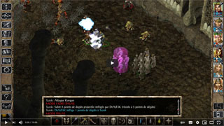
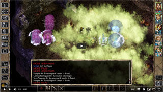
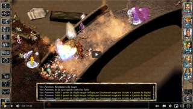
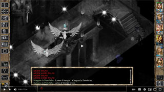

<h1>BuTcHeRy</h1>

<h3>A <a href="https://www.baldursgateworld.fr">La Couronne de Cuivre</a> mod for Baldur's Gate II:ToB (classical and EE games), 
Baldur's Gate Trilogy and EET<h3>

 

**Author:** <a href="https://www.baldursgateworld.fr/lacouronne/members/draztik.html">DrAzTiK</a>  
**Mod Website:** <a href="https://www.baldursgateworld.fr/lacouronne/modules-crees-ou-en-cours-de-developpement/">La Couronne de Cuivre</a>  
**Mod Forum:** <a href="https://www.baldursgateworld.fr/lacouronne/butchery/">BuTcHeRy</a>

## 

 

 

## 

:page_facing_up: [Read the mod's readme]()

:inbox_tray: [Download the mod at La Couronne de Cuivre]() 

## 

<a href="#intro">Overview</a> &#8226; <a href="#compat">Compatibility</a> &#8226; <a href="#installation">Installation</a> &#8226; <a href="#components">Components</a> &#8226; <a href="#images">Screenshots and Videos</a> &#8226; <a href="#credits">Credits and Acknowledgements</a> &#8226; <a href="#versions">Version History</a> 

## Overview

The main objectif of this little mod was to add a challenging and fun fight in Firkraag's hideout.

I like Baldur's Gate a lot, and I wrote this mod (first version in 2010) to become a minimum familiar with some modding stuffs. Thanks to Freddy_Gwendo, the BuTcHeRy is now compatible with the Enhanced Editions, EET and BGT. I also added a few improvements.

Secondary objectives are:

- Allow players to fight in a big room or large space because it is really boring and frustrating to fight in a corridor, especially in BG2.
- Bring BG2 as close as possible to a *Dungeon crawler* game.
- Difficulty level scaling: difficulty will be adjusted according to the game difficulty level which can be set in the Gameplay subsection of the Options menu. (more info <a href="#components">below</a>)
- Spice up many battles by turning them into 'butchery fights', with a few spawns and respawns.
- Make a few non-spellcaster creatures a bit more challenging (while non cheated) using kit abilities, having proficiencies in weapons, etc.
- Have challenging and charismatic boss (Tazok, DigDag, Sarevok).
- Keep 100% content of the original game. I add a few things, but I don't remove a single one.
- Add a bit of fun dialogues and cutscenes.
- No big loots or new magical items.
- Have 100% compatibility and optimisation with Stratagems and Item Revisions (especially with its '*potions revisions*' component).  

<a href="#top">Back to top</a>

## Compatibility

#### Games supported

This mod is designed to work on the following Infinity Engine games:

- Baldur's Gate II: Enhanced Edition (BG2EE).
- The original Baldur's Gate II (BG2, or just SoA) with the Throne of Bhaal (ToB) expansion. **Make sure you have Throne of Bhaal patched to version 26498.** Check the ReadMe files related to your patch in your game folder and the <a href="http://www.bioware.com/games/throne_bhaal/support/patches/">BioWare</a> website if necessary.
- The conversion projects based on ToB: <a href="http://www.shsforums.net/forum/261-bgt-weidu">Baldur's Gate Trilogy (BGT)</a> and <a href="https://github.com/Gibberlings3/EET/releases">Enhanced Edition Trilogy</a> (EET).

## 

#### Other Mods Compatibility

This is a WeiDU mod, and therefore should be compatible with all WeiDU mods. Though I am striving to make BuTcHeRy compatible with as many other mods as possible, there is always a chance that incompatibilities will arise. Below are the ones discovered thus far:

- BuTcHeRY is not compatible with Revisited Battles component '*Improved Firkraag*' (don't expect a crash but an impossible fight).

If you encounter any bugs, please <a href="https://www.baldursgateworld.fr/lacouronne/butchery/">report them on the mod forum!</a>

## 

#### Installation Order

>Classical games players are strongly recommended to download and install the latest version of the <a href="https://www.gibberlings3.net/mods/fixes/bg2fixpack/">BG2 Fixpack</a> before proceeding with the installation of this mod. 

Here is the recommended installation order:
- Please install BuTcHeRY after TobEx, BG2 Fixpack, and EET.
- Please install BuTcHeRY before any final "biffing" routines.

:warning: As I use vanilla scripts, you can further increase the difficulty if you install the Stratagems mod ('*Smarter general AI*' component). The first components are to be installed before Stratagems for a better experience and difficulty while the other components are to be installed after Stratagems (all this is detailed before the installation of each component).

RECOMMENDATION : you should also install the "<a href="http://www.mediafire.com/file/b9mtiwvj4aah42r/Derats_AutoRest_v4.zip/file">auto resting</a>" mod (from deratiseur) that allows you to restore your spells without having to rest for 8 hours. :wink:

<a href="#top">Back to top</a>

## Installation

#### Notes

*If you've previously installed the mod, remove it before extracting the new version. To do this, run __setup-butchery.exe__, un-install all previously installed components and delete the :file_folder: __butchery__ folder.*

*When installing or un-installing, __do not close the DOS window__ by clicking on the __X__ button! Instead, press the __Enter__ key whenever instructed to do so.*

*__Disable any antivirus__ or other memory-resident software before installing this or any other mod. Some (particularly avast and Norton!) have a tendency to report false positives with mod activity, resulting in failed installs.*

You can extract files from the archive using <a href="https://www.7-zip.org/download.html">7zip</a>, <a href="https://www.rarlab.com/download.htm">WinRAR</a>, <a href="https://zipgenius.com/">ZipGenius</a> or another file compression utility that handles .zip files.

## 

#### Enhanced Editions Note

The Enhanced Editions are actively supported games. Please note that every patch update will wipe your current mod setup! If in the middle of a modded game you might want to delay the patch update (if possible) as even after reinstalling the mods, you might not be able to continue with your old savegames. Alternatively, copy the whole game's folder into a new one that can be modded and will stay untouched by game patches. It is important that you install the mod to the language version you are playing the game in. Otherwise, the dialogues of the mod will not show but give error messages.

## 

#### Windows

BuTcHeRy for Windows is distributed as an extractable compressed archive and includes a WeiDU installer.

Extract the contents of the mod archive into the folder of the game you wish to modify (*the folder which contains the "CHITIN.KEY" file*). On successful extraction, there should be a :file_folder: butchery folder and a setup-butchery.exe file in your game folder. To install, simply double-click **`setup-butchery.exe`** and follow the instructions on screen.

Run **`setup-butchery.exe`** in your game folder to reinstall, un-install or otherwise change components.

## 

#### Mac OS

BuTcHeRy for Mac OS is distributed in the same compressed archive and includes a WeiDU installer.

First, extract the files from the archive into your game directory. On successful extraction, there should be a :file_folder: butchery folder, setup-butchery and setup-butchery.command files in your game folder. To install, simply double-click **`setup-butchery.command`** and follow the instructions on screen.

Run **`setup-butchery.command`** in your game folder to reinstall, un-install or otherwise change the components settings.

## 

#### Linux

The BuTcHeRy for Linux is distributed in the same compressed archive and does not include a WeiDU installer.

Extract the contents of the mod to the folder of the game you wish to modify.

Download the latest version of WeiDU for Linux from <a href="https://github.com/WeiDUorg/weidu/releases">WeiDU.org</a> and copy weidu and weinstall to `/usr/bin`. Following that, open a terminal, **cd** to your game installation directory, run tolower and answer 'Y' to both queries. You can avoid running the second option (linux.ini) if you've already ran it once in the same directory. To save time, the archive is already tolowered, so there's no need to run the first option (lowercasing file names) either if you've extracted only this mod since the last time you lowercased file names. If you're unsure, running tolower and choosing both options is the safe bet.

To install, run **`weinstall setup-butchery`** in your game folder. Then run **`wine bgmain.exe`** (or **`wine baldur.exe`** for EE games) and start playing.

## 

#### Note for Complete Un-installation

In addition to the methods above for removing individual components, you can completely un-install the mod using **`setup-butchery --uninstall`** at the command line to remove all components without wading through prompts. 

<a href="#top">Back to top</a>

## Components

The installer includes the following components. The number of each is the component `DESIGNATED` number which gives it a fixed install position, lets other components detect it and allows automated installers to specify component choices.

## 

><a href="#10">[10] DrAzTiK's revisited fight against Tazok and DigDag</a> <em>&nbsp;[install before Stratagems]</em> 
><a href="#11">[11] Rebalancing some generic creatures</a> <em>&nbsp;[install before Stratagems]</em> 
><a href="#12">[12] Rebalancing Tazok and DigDag</a> <em>&nbsp;[install before Stratagems]</em> 

><a href="#20">[20] Groumf and Bourrinos Encounter at Firkraag's Hideout entrance</a> <em>&nbsp;[install before Stratagems]</em> 
><a href="#21">[21] Groumf and Bourrinos Encounter at Brynnlaw</a> <em>&nbsp;[install before Stratagems]</em> 
><a href="#22">[22] Groumf and Bourrinos Encounter in the Underdark</a> <em>&nbsp;[install before Stratagems]</em> 

><a href="#30">{30] Revisited fight against Wraith Sarevok in the Abyss</a> <em>&nbsp;[install before Stratagems]</em> 
><a href="#31">{31] Move Samia group into Firkraag's Entrance (BETA and bugged) <em>&nbsp;[install before or after Stratagems]</em> 
><a href="#32">{32] Add battle songs in some areas that do not have any</a> <em>&nbsp;[install before or after Stratagems]</em> 

><a href="#40">{40] DrAzTiK's Creatures</a> <em>&nbsp;[install before Stratagems]</em> 

><a href="#41">[41] Butchery in Irenicus Dungeon (Dwarves)</a> <em>&nbsp;[install after Stratagems]</em> 
><a href="#42">[42] Butchery for high and low reputation traps (BETA, BUGGED, NOT FINISHED)</a> <em>&nbsp;[install after Stratagems]</em> 
><a href="#43">[43] Butchery in the Forest of Tethyr (Animals and Druids)</a> <em>&nbsp;[install after Stratagems]</em> 
><a href="#44">[44] Butchery in the planar sphere (Demonic creatures)</a> <em>&nbsp;[install after Stratagems]</em> 
><a href="#45">[45] 3 butcheries in Spellhold (Golems, Vampires and Trolls)</a> <em>nbsp;[install after Stratagems]</em> 
><a href="#46">[46] Butchery outside de'Arnise Keep (Trolls)</a> <em>&nbsp;[install after Stratagems]</em> 
><a href="#47">[47] Butchery in Windspear Hills (Orcs)</a> <em>&nbsp;[install after Stratagems]</em> 
><a href="#48">[48] Butchery in Umar Hills (Wolves)</a> <em>&nbsp;[install after Stratagems]</em> 
><a href="#49">[49] 2 butcheries in Trademeet and outside Watcher's Keep (Animals)</a> <em>&nbsp;[install after Stratagems]</em> 
><a href="#50">[50] 2 butcheries of golems in Suldanessellar and Watcher's Keep (Machine of Lum the Mad floor)</a> <em>&nbsp;[install after Stratagems]</em> 
><a href="#51">[51] Butchery of Yaga-Shura revisited</a> <em>&nbsp;[install after Ascension and Stratagems]</em> 
><a href="#52">[52] Butchery in the Druid Grove area (Animals and Druids)</a> <em>&nbsp;[install after Stratagems]</em> 
><a href="#53">[53] Butchery in the Beholder Hideout (Fanatics)</a> <em>&nbsp;[install after Stratagems]</em> 
><a href="#54">[54] Butchery in Bodhi's Hideout (chapter 2, before Underdark) - Vampires</a> <em>&nbsp;[install after Stratagems]</em> 
><a href="#55">[55] Butchery in Bodhi's Hideout (chapter 6, after Underdark) - Vampires</a> <em>&nbsp;[install after Stratagems]</em> 
><a href="#56">[56] 2 butcheries of Sahuagins in Sahuagin City and Watcher's Keep (Githyanki Encampment)</a> <em>&nbsp;[install after Stratagems]</em> 
><a href="#57">[57] 4 butcheries of spiders in Pai'Na's Hideout entrance, Temple City (Unseeing Eye Plot), Watcher's Keep 1st floor and area outside Sendai's Hideout</a> <em>&nbsp;[install after Stratagems]</em> 
><a href="#58">[58] 6 butcheries of skeletons in lower tombs of Athkatla, Shadow Temple Land, Spellhold, Watcher's Keep (Last Seals) and Nyalee's Hideout (2)</a> <em>&nbsp;[install after Stratagems]</em> 

><a href="#80">[80] More enemies scattered throughout the game</a> <em>&nbsp;[install after Stratagems]</em> 

><a href="#90">[90] Cosmetic component</a> <em>&nbsp;[install before or after Stratagems]</em> 

#### &#10173; Difficulty level scaling:

This is the major latest mod improvement. I know that it can be frustrating to have a too much difficult -or easy- fight, so this new possibility will surely be appreciated. The numbers and variety of opponents are now adjusted according to the game difficulty level which can be set in the Gameplay subsection of the Options menu. These adjustments are reflected as follows:

- <ins>Core Rules</ins>: normal and decent amount of enemies (no divine or arcane enemies spellcasters).
- <ins>Difficult</ins>: a bit more numerous enemies and especially divine/arcane enemies spellcasters.
- <ins>Very difficult</ins>: again, a bit more enemies and a even more divine/arcane enemies spellcasters.

Be aware that even with Core Rules, the challenge might be quite difficult (especially before Underdark) because this mod adresses to players looking for a better challenge. :wink:

<a href="#top">Back to top</a>

------------------------

&#10173; **[10] DrAzTiK's revisited fight against Tazok and DigDag**
###### &nbsp;&nbsp;&nbsp;&nbsp;&nbsp;<em>install before Stratagems</em>  

This is the very first component, and the genesis of this mod.

I have always found the fight against Tazok and DigDag in Firkraag's Hideout nothing more than a pathetic joke. Obviously, Firkaag is supposed to be an optional boss (like the shadow dragon) surely unbeatable before Underdark. All banters and interjections suppose the party want to escape in front of Firkraag without thinking twice and come back later, really later.

So I assume Tazok and DigDag are supposed to be the big vilains in Firkaag's lair and IMO the fight deserves to be a bit more challenging and fun. The fight vs Tazok and DigDag will now take place where you usually fight Firkraag (AR1203). Don't worry, you will be also able to fight Firkraag. This component doesn't modify or tweak creatures at all except:

- DigDag gets a new script, letting him have some new dialogs and drink 2 potions before fighting.
- Tazok gets a new script, allowing him to drink 2 potions before fighting.

This component also adds some of my customs creatures and especially two fighters of my own composition. Their duty is to protect Tazok and DigDag during the final fight.

:warning: <ins>Note for English language players</ins>: Two new creatures get their own soundsets, unfortunately only available in French. But they have been traified as for the latest version &#128521; and they are still waiting for their English sound files. If anyone would provide them, I would be pleased to include them in the next version. &#128578;

<a href="#components">Back to components list</a>

## 

&#10173; **[11] Rebalancing some generic creatures**
###### &nbsp;&nbsp;&nbsp;&nbsp;&nbsp;<em>install before Stratagems</em>  

&#9755; This component improves stats, saving throws, hit points and skill points of a few generic creatures (orc and ogre fighters at the beginning, and many animals and other creatures as of version 5.0.0). Most of them have now a barbarian or berserker kit, a weapon which suits their avatars, etc. but I often keep their vanilla level. But you will need to install Stratagems for these creatures to use their special abilities.

Enemy skeletons and mummies' abilities are standardised: they still have 100% resistance to electricity and cold and 10% magic resistance per level. Their resistance to missile attacks is 90%. This makes them fearsome foes.

In addition, some of the "half-bosses" have had their combat stats and equipment upgraded a bit (Ilyich in particular).

<table style="margin-left: 80px" summary="Rebalanced generic creatures">
	<tr>
		<th>Creature</th>
		<th>Kit</th>
		<th>Level &#160;&#160;&#160;(ex)</th>
		<th>XP &#160;&#160;&#160;(ex)</th>
		<th>HP &#160;&#160;&#160;(ex)</th>
		<th>Strength &#160;&#160;&#160;(ex)</th>
		<th>Constitution &#160;&#160;&#160;(ex)</th>
		<th>Weapon proficiency</th>
	</tr>
	<tr>
		<td>OGRE01</td>
		<td>Berserker</td>
		<td><strong>5</strong>&#160;&#160;&#160;(4)</td>
		<td><strong>600</strong>&#160;&#160;&#160;(270)</td>
		<td><strong>50</strong>&#160;&#160;&#160;(30)</td>
		<td><strong>20</strong>&#160;&#160;&#160;(18/100)</td>
		<td><strong>18</strong>&#160;&#160;&#160;(9)</td>
		<td>MORNING STAR & MACE +++</td>
	</tr>
	<tr>
		<td>ORC01</td>
		<td>Barbarian</td>
		<td><strong>5</strong>&#160;&#160;&#160;(4)</td>
		<td><strong>600</strong>&#160;&#160;&#160;(95)</td>
		<td><strong>50</strong>&#160;&#160;&#160;(35)</td>
		<td><strong>19</strong>&#160;&#160;&#160;(18/10)</td>
		<td><strong>18</strong>&#160;&#160;&#160;(9)</td>
		<td>AXE ++</td>
	</tr>
	<tr>
		<td>ORC02</td>
		<td>--</td>
		<td><strong>5</strong></td>
		<td><strong>600</strong>&#160;&#160;&#160;(35)</td>
		<td><strong>50</strong>&#160;&#160;&#160;(35)</td>
		<td><strong>18</strong>&#160;&#160;&#160;(11)</td>
		<td><strong>17</strong>&#160;&#160;&#160;(10)</td>
		<td>COMPOSITE LONG BOW +++ & BASTARD ++</td>
	</tr>
	<tr>
		<td>ORC05 (Orog)</td>
		<td>Barbarian</td>
		<td><strong>7</strong>&#160;&#160;&#160;(4)</td>
		<td><strong>800</strong>&#160;&#160;&#160;(600)</td>
		<td><strong>91</strong>&#160;&#160;&#160;(40)</td>
		<td><strong>20</strong>&#160;&#160;&#160;(18/53)</td>
		<td><strong>20</strong>&#160;&#160;&#160;(9)</td>
		<td>TWO-HANDED SWORD +++</td>
	</tr>
	<tr>
		<td>ORC06 (Orog)</td>
		<td>Berserker</td>
		<td><strong>7</strong>&#160;&#160;&#160;(4)</td>
		<td><strong>800</strong>&#160;&#160;&#160;(175)</td>
		<td><strong>75</strong>&#160;&#160;&#160;40)</td>
		<td><strong>20</strong>&#160;&#160;&#160;(18/92)</td>
		<td><strong>20</strong>&#160;&#160;&#160;(9)</td>
		<td>TWO-HANDED SWORD +++</td>
	</tr>
</table> 

Except high scores in STR and CON, these creatures have now the same features and obey the same rules as other humanoids (thac0, saves, hit point, kit bonus etc..), except they remain a bit slow, have an incredible moral and a good AC.

You will find mostly theses creatures only in Windspear Hills and in Firkraag's Hideout. I also added a lot of them in my mod (the reason why I wrote this component).

I didn't modify vanilla fighting scripts at all. So if you don't install Stratagems '*Smarter general AI*' component, theses creatures will not use their kit abilities.

<a href="#components">Back to components list</a>

## 

&#10173; **[12] Rebalancing Rebalancing Tazok and DigDa**
###### &nbsp;&nbsp;&nbsp;&nbsp;&nbsp;<em>install before Stratagems</em>  

&#9755; In vanilla, Tazok is an ORC Level 18 standard fighter, and DigDag an ORC level 12 standard fighter. This component tweaks Tazok lightly (slightly better saving thrown and hp), turns DigDag into a Berserker, and improves their levels by one (level 19 for Tazok and 13 for DigDag). It is also cosmetic: Tazok is now a half ogre again (as in BG1) while DigDag inherits the OROG CHIEFTAIN animation.

If you want Tazok to be a berseker, you must install stratagems '*Smarter general AI*' component (no problem of compatibility issue).

Equipment, stats and proficiencies are tweaked a bit, especially DigDag's ones.

<table style="margin-left: 80px" summary="Rebalanced Tazok and Dig-Dag">
	<tr>
		<th>Creature</th>
		<th>Kit</th>
		<th>Level (ex)</th>
		<th>XP (ex)</th>
		<th>HP (ex)</th>
		<th>Strength (ex)</th>
		<th>Constitution (ex)</th>
		<th>Weapon proficiency</th>
	</tr>
	<tr>
		<td>Tazok</td>
		<td>--</td>
		<td><strong>19</strong>&#160;&#160;&#160;(18)</td>
		<td><strong>12000</strong>&#160;&#160;&#160;(6000)</td>
		<td><strong>154</strong>&#160;&#160;&#160;(136)</td>
		<td>--</td>
		<td>--</td>
		<td>TWO-HANDED SWORD +++++</td>
	</tr>
	<tr>
		<td>FIRorc01 (DigDag)</td>
		<td>Berserker</td>
		<td><strong>13</strong>&#160;&#160;&#160;(12)</td>
		<td><strong>7000</strong>&#160;&#160;&#160;2000)</td>
		<td><strong>107</strong>&#160;&#160;&#160;(99)</td>
		<td><strong>22</strong>&#160;&#160;&#160;(17)</td>
		<td><strong>22</strong>&#160;&#160;&#160;(9)</td>
		<td>BASTARD SWORD +++++</td>
	</tr>
</table> 

<a href="#components">Back to components list</a>

## 

&#10173; **[20] Groumf and Bourrinos Encounter at Firkraag's Hideout entrance**
###### &nbsp;&nbsp;&nbsp;&nbsp;&nbsp;<em>install before Stratagems</em>  

&#9755; This component adds a small fight and a funny encounter with 2 funny characters at Firkraag's Hideout entrance, the same ones who serve as Tazok's bodyguards if you have installed the previous components.

<a href="#components">Back to components list</a>

## 

&#10173; **[21] Groumf and Bourrinos Encounter at Brynnlaw**
###### &nbsp;&nbsp;&nbsp;&nbsp;&nbsp;<em>install before Stratagems&nbsp;&nbsp;-&nbsp;&nbsp;Requires component <a href="#20">[20] Groumf and Bourrinos Encounter at Firkraag's Hideout entrance</a></em>  

&#9755; This component adds another little fight and a funny encounter with these same characters.

<a href="#components">Back to components list</a>

## 

&#10173; **[22] Groumf and Bourrinos Encounter in the Underdark**
###### &nbsp;&nbsp;&nbsp;&nbsp;&nbsp;<em>install before Stratagems</em>  

&#9755; This component adds another little fight and a funny encounter with these same characters.

<a href="#components">Back to components list</a>

## 

&#10173; **[30] Revisited fight against Wraith Sarevok in the Abyss**
###### &nbsp;&nbsp;&nbsp;&nbsp;&nbsp;<em>install before Stratagems</em>  

&#9755; This component greatly improves the final battle against Sarevok in the layer of the Abyss once ruled by Bhaal. The latter will be assisted by his former teammates from BG1.

<a href="#components">Back to components list</a>

## 

&#10173; **[31] Move Samia group into Firkraag's Entrance**
###### &nbsp;&nbsp;&nbsp;&nbsp;&nbsp;<em>install before or after Stratagems</em>  

&#9755; This component moves Samia and her teammates into Firkraag's Entrance.

:warning: This component is disabled because it is still under development. Do not try to force its installation as it is bugged.

<a href="#components">Back to components list</a>

## 

&#10173; **[32] Add battle songs in some areas that do not have any**
###### &nbsp;&nbsp;&nbsp;&nbsp;&nbsp;<em>install before or after Stratagems</em>  

&#9755; This component assigns battle song to a few areas that don't have one: Temple City (The Forgotten Believers), Sewers beneath Coronet, Shadow Temple land shadowed, Troll Cave (Spellhold test), and Tethyr Wood.

<a href="#components">Back to components list</a>

## 

&#10173; **[40] DrAzTiK's Creatures**
###### &nbsp;&nbsp;&nbsp;&nbsp;&nbsp;<em>install before Stratagems</em>  

&#9755; This component adds creatures of my creation to the game's bestiary. It is required for some of the following components.

<a href="#components">Back to components list</a>

## 

&#10173; **[41] Butchery in Irenicus Dungeon (Dwarves)**
###### &nbsp;&nbsp;&nbsp;&nbsp;&nbsp;<em>install after Stratagems</em>&nbsp;&nbsp;-&nbsp;&nbsp;Requires component <a href="#40">[40] DrAzTiK's Creatures</a></em>  

&#9755; This component adds a battle against a few dozen enemies in Irenicus Dungeon 2nd floor area.

<a href="#components">Back to components list</a>

## 

&#10173; **[42] Butchery for high and low reputation traps**
###### &nbsp;&nbsp;&nbsp;&nbsp;&nbsp;<em>install after Stratagems</em>  

:warning: This component is disabled because it is still under development. Do not try to force its installation as it is bugged.

<a href="#components">Back to components list</a>

## 

&#10173; **[43] Butchery in the Forest of Tethyr (Animals and Druids)**
###### &nbsp;&nbsp;&nbsp;&nbsp;&nbsp;<em>install after Stratagems</em>  

&#9755; This component adds a battle against a few dozen enemies in the Forest of Tethyr area.

<a href="#components">Back to components list</a>

## 

&#10173; **[44] Butchery in the planar sphere (Demonic creatures)**
###### &nbsp;&nbsp;&nbsp;&nbsp;&nbsp;<em>install after Stratagems</em>  

&#9755; This component adds a battle against a few dozen enemies in the planar sphere (Demon Plane area).

<a href="#components">Back to components list</a>

## 

&#10173; **[45] 3 butcheries in Spellhold (Golems, Vampires and Trolls)**
###### &nbsp;&nbsp;&nbsp;&nbsp;&nbsp;<em>install after Stratagems&nbsp;&nbsp;-&nbsp;&nbsp;Requires component <a href="#40">[40] DrAzTiK's Creatures</a></em>  

&#9755; This component adds 3 battles against a few dozen enemies in Spellhold: Spellhold, Bodhi's Hunt Level 1, and Troll Cave (Spellhold Test).

<a href="#components">Back to components list</a>

## 

&#10173; **[46] Butchery outside de'Arnise Keep (Trolls)**
###### &nbsp;&nbsp;&nbsp;&nbsp;&nbsp;<em>install after Stratagems&nbsp;&nbsp;-&nbsp;&nbsp;Requires component <a href="#40">[40] DrAzTiK's Creatures</a></em>  

&#9755; This component adds a battle against a few dozen enemies in de'Arnise Keep outer courtyard.

<a href="#components">Back to components list</a>

## 

&#10173; **[47] Butchery in Windspear Hills (Orcs)**
###### &nbsp;&nbsp;&nbsp;&nbsp;&nbsp;<em>install after Stratagems</em>  

&#9755; This component adds a battle against a few dozen enemies in the Windspear Hills area.

<a href="#components">Back to components list</a>

## 

&#10173; **[48] Butchery in Umar Hills (Wolves)**
###### &nbsp;&nbsp;&nbsp;&nbsp;&nbsp;<em>install after Stratagems</em>  

&#9755; This component adds a battle against a few dozen enemies in the Umar Hills area.

<a href="#components">Back to components list</a>

## 

&#10173; **[49] 2 butcheries in Trademeet and outside Watcher's Keep (Animals)**
###### &nbsp;&nbsp;&nbsp;&nbsp;&nbsp;<em>install after Stratagems</em>  

&#9755; This component adds a battle against a few dozen enemies in Trademeet and outside Watcher's Keep areas.

<a href="#components">Back to components list</a>

## 

&#10173; **[50] 2 butcheries of Golems in Suldanessellar and Watcher's Keep (Machine of Lum the Mad floor)**
###### &nbsp;&nbsp;&nbsp;&nbsp;&nbsp;<em>install after Stratagems</em>  

&#9755; This component adds a battle against a few dozen enemies in Suldanessalar and in Watcher's Keep (Machine of Lum the Mad floor).

<a href="#components">Back to components list</a>

## 

&#10173; **[51] Butchery of Yaga-Shura revisited**
###### &nbsp;&nbsp;&nbsp;&nbsp;&nbsp;<em>install after Ascension and Stratagems</em>  

&#9755; This component greatly modifies the battle against Yaga-Shura army in ToB to make it longer and more difficult. It will only work if you have Acsension (David Wallace's version) and Stratagems installed.

<a href="#components">Back to components list</a>

## 

&#10173; **[52] Butchery in the Druid Grove area (Animals and Druids)**
###### &nbsp;&nbsp;&nbsp;&nbsp;&nbsp;<em>install after Stratagems</em>  

&#9755; This component adds a battle against a few dozen enemies in the Druid Grove area.

<a href="#components">Back to components list</a>

## 

&#10173; **[53] Butchery in the Beholder Hideout (Fanatics)**
###### &nbsp;&nbsp;&nbsp;&nbsp;&nbsp;<em>install after Stratagems</em>  

&#9755; This component adds a battle against a few dozen enemies in the Beholder Hideout (Unseeing Eye Plot).

<a href="#components">Back to components list</a>

## 

&#10173; **[54] Butchery in Bodhi's Hideout (chapter 2, before Underdark) - Vampires**
###### &nbsp;&nbsp;&nbsp;&nbsp;&nbsp;<em>install after Stratagems</em>  

&#9755; This component adds a battle against a few dozen enemies in Bodhi's Hideout (chapter 2, before Underdark).

<ins>Note</ins>: The traps on the spiked floor in the torture room with the blood-encrusted drain have been deactivated so that you can fight there without any hindrance.

<a href="#components">Back to components list</a>

## 

&#10173; **[55] Butchery in Bodhi's Hideout (chapter 6, after Underdark) - Vampires**
###### &nbsp;&nbsp;&nbsp;&nbsp;&nbsp;<em>install after Stratagems</em>  

&#9755; This component adds a battle against a few dozen enemies in Bodhi's Hideout (chapter 6, after Underdark).

<ins>Note</ins>: The traps on the spiked floor in the torture room with the blood-encrusted drain have been deactivated so that you can fight there without any hindrance.

<a href="#components">Back to components list</a>

## 

&#10173; **[56] 2 butcheries of Sahuagins in Sahuagin City and Watcher's Keep (Githyanki Encampment)**
###### &nbsp;&nbsp;&nbsp;&nbsp;&nbsp;<em>install after Stratagems</em>  

&#9755; This component adds a battle against a few dozen enemies in the Sahuagin and Watcher's Keep (Githyanki Encampment).

<a href="#components">Back to components list</a>

## 

&#10173; **[57] 4 butcheries of spiders**
###### &nbsp;&nbsp;&nbsp;&nbsp;&nbsp;<em>à installer après Stratagems</em>  

&#9755; This component adds a battle against a few dozen enemies in front of Pai'Na's Hideout entrance (Bodhi's Hideout), the Temple City (Unseeing Eye Plot) area, Watcher's Keep 1st floor (Altar level) and in the area outside Sendai's Hideout. 

<a href="#components">Back to components list</a>

## 

&#10173; **[58] 6 butcheries of skeletons in lower tombs of Athkatla, Shadow Temple Land, Spellhold, Watcher's Keep, and Nyalee's Hideout (2)**
###### &nbsp;&nbsp;&nbsp;&nbsp;&nbsp;<em>install after Stratagems&nbsp;&nbsp;-&nbsp;&nbsp;Requires component <a href="#40">[40] DrAzTiK's Creatures</a></em>  

&#9755; This component adds a battle against a few dozen skeletons throughout the game: in the lower tombs of Athkatla (Southern Dungeons), in the Shadow Temple Land (shadowed) at the Temple of Amaunator entrance, in Spellhold (Bodhi's Hunt Level 1), Watcher's Keep (Helmite Level - Last Seals), and two in Nyalee's Hideout.

<a href="#components">Back to components list</a>

## 

&#10173; **[80] Transformer BG2 en Dungeon crawler**
###### &nbsp;&nbsp;&nbsp;&nbsp;&nbsp;<em>install after Stratagems&nbsp;&nbsp;-&nbsp;&nbsp;Composant pré-requis : <a href="#40">[40] Créatures de DrAzTiK</a></em>  

&#9755; This component adds a lot of enemies in areas that are usually very quiet and unchallenging. This makes the gameplay more like a Dungeon Crawler, like in Icewind Dale.

<ins>Note</ins>: This component being quite difficult, unlike the previous ones, adjusting the difficulty level of the game will have no effect. However, I have taken care to set a reasonable challenge.

&#160;&#160;List of affected areas:

&#9755; <ins>Waukeen's Promenade</ins>
- AR0601: Air Plane in Irenicus's Dungeon
- AR0602: Irenicus's Dungeon 1st Floor
- AR0603: Irenicus's Dungeon 2nd Floor
- AR0600: Circus Tent (phased)
- AR0605: Circus Tent 2nd Floor
- AR0606: Circus Tent 3rd Floor

&#9755; <ins>Slums District</ins>
- AR0404: Sewers beneath Coronet
- AR0418: Sewers beneath Coronet (Myconids)
- AR0405: Slaver's Ship Building
- AR0419: Planar Sphere (Myconid)
- AR0420: Planar Sphere (Lizardmen Hideout)

&#9755; <ins>Temple District</ins>
- AR0201: Leading to ghoul village and beholder lair
- AR0206: Ghoul village
- AR0204: The Forgotten Believers - Temple City (Unseeing Eye Plot)
- AR0205: The Beholder Hideout (Unseeing Eye Plot)

&#9755; <ins>Bridge</ins>
- AR0502: Tanner's Hideout Cellar
- AR0503: Tanner's Hideout Dock
- AR0525: House 1st Floor
- AR0701: The Sewers

&#9755; <ins>Graveyard</ins>
- AR0801: Bodhi's Hideout (sided with Aran)
- AR0803: Bodhi's Lair (sided with Aran)
- AR0802: Netherscroll, Korgan's Book, Edwin
- AR0805: Crypt
- AR0810: Crypt
- AR0811: Crypt
- AR0812: Crypt

&#9755; <ins>Other SoA areas</ins>
- AR1106: Umar's Cave
- AR1201: Firkraag's Entrance
- AR1202: Firkaag's Maze
- AR2013: Trademeet Crypt

&#9755; <ins>ToB</ins>
- AR2602 Forest of Tethyr: Cave in Woods to Suldanessellar

 

<a href="#components">Back to components list</a>

## 

&#10173; **[90] Composant cosmétique**
###### &nbsp;&nbsp;&nbsp;&nbsp;&nbsp;<em>install before or after Stratagems</em>  

&#9755; Ce composant attribue aux drows des animations d'elfes.

<a href="#components">Back to components list</a>

## Screenshots and Videos

#### Screenshots

 

&#9755; <a href="https://drive.google.com/drive/folders/1EVZWZKG49dUambKGScVvDqwSrgi-S-To?usp=sharing">More screenshots</a>

## 

#### Videos

DrAzTiK's revisited fight against Tazok and DigDag (BG2:EE)

&nbsp;

")

 

Revisited fight against Wraith Sarevok in the Abyss (BG2:EE)

&nbsp;

")

 

Butchery of animals in Trademeet (BG2:EE)

&nbsp;

")

 

Revisited Yaga-Shura fight (BG2:EE)

&nbsp;

")

 

Kangaax fight (BG2:EE)

&nbsp;

")

 

&#9755; <a href="https://www.youtube.com/playlist?list=PL7q-07v2VkmHTjJdTlaHkA2EHpmSi6rf9">More videos</a>

<a href="#top">Back to top</a>

## Credits and Acknowledgements

**Author:** <a href="https://www.baldursgateworld.fr/lacouronne/members/draztik.html">DrAzTiK</a>

&#9755; For support or questions, please visit the <a href="https://www.baldursgateworld.fr/lacouronne/butchery/">mod forum</a>.

## 

#### Special Acknowledgements to:

- <a href="https://www.baldursgateworld.fr"><acronym title="Copper Coronet">La Couronne de Cuivre</acronym></a> team for hosting the mod.
- The creators of the Baldur's Gate series: <a href="https://www.bioware.com/">Bioware</a> and <a href="https://www.obsidian.net/">Black Isle Studios</a>.
- Big thanks to yota13 for providing the Russian translation.
- Big thanks to Freddy_Gwendo (aka Gwendolyne) for make the update of this mod possible.
- Thanks to Pen of Chaos for borrowing his barbarian French soundset.
- Thanks to artists from <a href="https://www.pinterest.fr/">Pinterest</a> for their portraits.
- Everyone else from the <a href="https://www.baldursgateworld.fr">La Couronne de Cuivre</a>, <a href="https://www.gibberlings3.net/forums/">The Gibberlings Three</a>, <a href="http://www.shsforums.net/">Spellhold Studios</a> forums, and the other Infinity Engine gaming and modding communities who offered their help and support.

## 

#### Programs/tools used in creation:

- <a href="https://github.com/WeiDUorg/weidu/releases">WeiDU</a>, by Wes Weimer, the bigg and Wisp.
- <a href="https://github.com/Argent77/NearInfinity/releases">Near Infinity</a>, by Jon Olav Hauglid, FredSRichardson, and Argent77.
- <a href="http://www.shsforums.net/topic/31285-infinity-explorer-v085/">Infinity Explorer</a>, by Dmitry Jemerov / bigmoshi.
- <a href="https://www.gibberlings3.net/mods/tools/dltcep/">DLTCEP</a>, by Avenger.
- <a href="http://www.baldursgatemods.com/forums/index.php?action=downloads;sa=view;down=85">CreMaker_v3.1.9</a>.
- <a href="https://gibberlings3.github.io/iesdp/">IESDP</a>, maintained by igi and lynx.
- <a href="http://notepad-plus-plus.org/">Notepad++</a>, by the Notepad++ team, Don Ho, and the spellcheck plug-in.
- <a href="http://www.shsforums.net/files/file/1048-weidu-highlighter-for-notepad/">WeiDU Notepad++ Highlighters </a>, by Argent77.
- <a href="https://www.bulkrenameutility.co.uk/">Bulk Rename Utility</a>, by TGRMN Software.

## 

#### Copyright Information

###### The BuTcHeRy is not developed, supported, or endorsed by BioWare&trade; or Interplay/BlackIsle, Overhaul, Beamdog or the Wizards of the Coast. It was developed by DrAzTiK, based on material from the game Baldur's Gate II and its expansion.
###### All mod content is &copy;DrAzTiK.
###### Baldur's Gate II: Shadows of Amn and Baldur's Gate II: Throne of Bhaal &copy; TSR, Inc. The BioWare Infinity Engine is &copy; BioWare Corp. All other trademarks and copyrights are property of their respective owners.
###### If there are any copyright issues or this statement needs revision, then please contact me and advise me what to do about it. Most notably, if you see any artwork in this mod that might conflict with Copyright rules, please let me know as soon as possible, and I will remove the conflicting content immediately.
###### This mod was created to be freely enjoyed by all Baldur's Gate II players, and its content is free of rights. Feel free to borrow what you need if you find something interesting. I will not sue anyone, don't worry.  

<a href="#top">Back to top</a>

## Version History

##### Version 5.0.0 &nbsp;(September nn, 2021)

- Added *butchery.ini* metadata file (including dynamic install order syntax and global `LABELS`) to support AL|EN's "Project Infinity".
- Replaced `AUTHOR` keyword with `SUPPORT`.
- Added `REQUIRE_PREDICATE` conditions to avoid installing the mod in inaccurate games.
- Commented code as much as possible.
- Fixed installer to avoid installing the same files more than once, regardless of the components installed.
- Added native EE and EET compatibility:
    - Added chapters continuity for EET games.
    - Provided accurate sized NPC portraits for EE games.
- Added "*Groumf and Bourrinos Encounter at Firkraag's Hideout entrance*" component.
- Added "*Groumf and Bourrinos Encounter at Brynnlaw*" component.
- Added "*Groumf and Bourrinos Encounter in the Underdark*" component.
- Added "*Revisited fight against Wraith Sarevok in the Abyss*" component.
- Added "*Add battle songs in some areas that do not have any*" component.
- Added "*DrAzTiK's Creatures*" component.
- Added "*Butchery in Irenicus Dungeon (Dwarves)*" component.
- Added "*Butchery in the Forest of Tethyr (Animals and Druids)*" component.
- Added "*Butchery in the planar sphere (Demonic creatures)*" component.
- Added "*3 butcheries in Spellhold (Golems, Vampires and Trolls)*" component.
- Added "*Butchery outside de'Arnise Keep (Trolls)*" component.
- Added "*Butchery in Windspear Hills (Orcs)*" component.
- Added "*Butchery in Umar Hills (Wolves)*" component.
- Added "*2 butcheries in Trademeet and outside Watcher's Keep (Animals)*" component.
- Added "*2 butcheries of Golems in Suldanessellar and Watcher's Keep (Machine of Lum the Mad floor)*" component.
- Added "*Butchery of Yaga-Shura revisited*" component.
- Added "*Butchery in the Druid Grove area (Animals and Druids)*" component.
- Added "*Butchery in the Beholder Hideout (Fanatics)*" component.
- Added "*Butchery in Bodhi's Hideout (chapter 2, before Underdark) - Vampires*" component.
- Added "*Butchery in Bodhi's Hideout (chapter 6, after Underdark) - Vampires*" component.
- Added "*2 butcheries of Sahuagins in Sahuagin City and Watcher's Keep (Githyanki Encampment)*" component.
- Added "*4 butcheries of spiders in Pai'Na's Hideout entrance, Temple City (Unseeing Eye Plot), Watcher's Keep first floor (Altar level) and in the area outside Sendai's Hideout*" component.
- Added *6 butcheries of skeletons in the lower tombs of Athkatla, Shadow Temple Land, Spellhold, Watcher's Keep (Last Seals), and 2 in Nyalee's Hideout*" component.
- Added "*More enemies scattered throughout the game*" component.
- Added "*Cosmetic component*" component.
- "*DrAzTiK's revisited fight against Tazok and DigDag*" component:
    - Renamed .tpa file name to *10_improved_tazok_fight.tpa*.
    - Flagged potions as "undroppable" in creatures' inventories.
    - Added `Continue()` action when appending are .bcs files with `EXTEND_TOP` command.
- "*Rebalancing some generic creatures*" component:
    - Renamed .tpa file name to *11_rebalancing_creatures.tpa*.
    - Improved more creatures statistics.
- "*Rebalancing Tazok and DigDag*" component:
    - Renamed .tpa file name to *12_rebalancing_tazok.tpa*.
    - Flagged potions as "undroppable" in creatures' inventories.
    - Compiled *d9tazokk.baf* if 1st component has not been installed.
- ...
- Added Russian translation (by yota13).
- Proofread English strrefs and completed English translation (Gwendolyne).
- Added brand new *butchery-readme-%LANGUAGE%.html* files, with videos and moved them into new :file_folder: *readme* folder.
- Removed useless :file_folder: "*backup*" folder.
- Lower cased files.
- Included Linux and macOS versions in the same package (thanks AL|EN's Infinity Auto Packager tool!).
- Updated OggDec to v1.9.7 and added sox v14.4.1 for mac.
- Added archive libiconv-1.9.2-1-src.7z with iconv licence info.
- Updated WeiDU installer to v247.

## 

##### Version 4.0.0 &nbsp;(October 20, 2018)

- General overhaul and relooking:

	- Integrated all BWP Fixpack patches: <a href="http://www.shsforums.net/topic/42220-fixes-for-the-big-fixpack/?p=524893">Lollorian's override compilation fix</a> (changes `COMPILE xyz.d/baf override` to `COMPILE xyz.d/baf`) and unknown origin patch that set ORC05.CRE's BG1 Long Swords proficiency to 0.
	- Provided full compatibility with Stratagems and Item Revisions.
	- tp2 split into components and commented for easier further updates.
	- Reorganized components (`DESIGNATED` numbers).
	- Added BG2EE compatibility (probably with EET, but not yet tested).
	- Fixed wrong coding: turned `WRITE_SHORT 0x028` to `WRITE_LONG 0x028` (animation slot is a dword, not a word!) and `WRITE_BYTE 0x242` to `WRITE_SHORT 0x242` (Morale recovery is a word, not a byte).
	- Polished `WRITE_ASCII` command with #n.
	- No longer overwrites mod item files if there are already installed.
	- Used new WeiDU variables (INV RING QITEM...) with `ADD_CRE_ITEM` command.
	- Provided new portraits for BG2:EE.
	- Reworked install procedure to use WeiDU's built-in `HANDLE_AUDIO` function to install soundsets.
	- Used `HANDLE_CHARSETS` function to add BG2EE compatibility for languages other than English.
	- Removed unused files from mod folder.
	- Updated readme (Butchery now supports translated readmes)
	- Revamped French translation and fixed English typos courtesy of Gwendolyne.
	- Traified creatures soundsets (still waiting for English sound files).
	- Reorganized and merged tra files into 3 files.
	- Updated WeiDU installer to v246.

- Components specific modifications and fixes: please read the <a href="https://raw.githubusercontent.com/GwendolyneFreddy/butchery/master/butchery/change-log.txt">change-log file</a>.

## 

##### Version 3.2 &nbsp;(October 10, 2011)
- Increased Tazok to level 19 Barbarian.
- Added a magical armor to Tazok.
- Increased DigDag to level 13 Berseker.
- Decreased the number of Orcs spawned in final fight.

## 

##### Version 3 &nbsp;(March 1, 2011)
- Better compatibility with SCS II (especially more sensible choices of weapon proficiencies and kits for fighters component).

## 

##### Version 2 &nbsp;(November 30, 2010)
- Added French translation.

## 

##### Version 1 &nbsp;(November 11, 2010)
- Initial release.

<a href="#top">Back to top</a>

